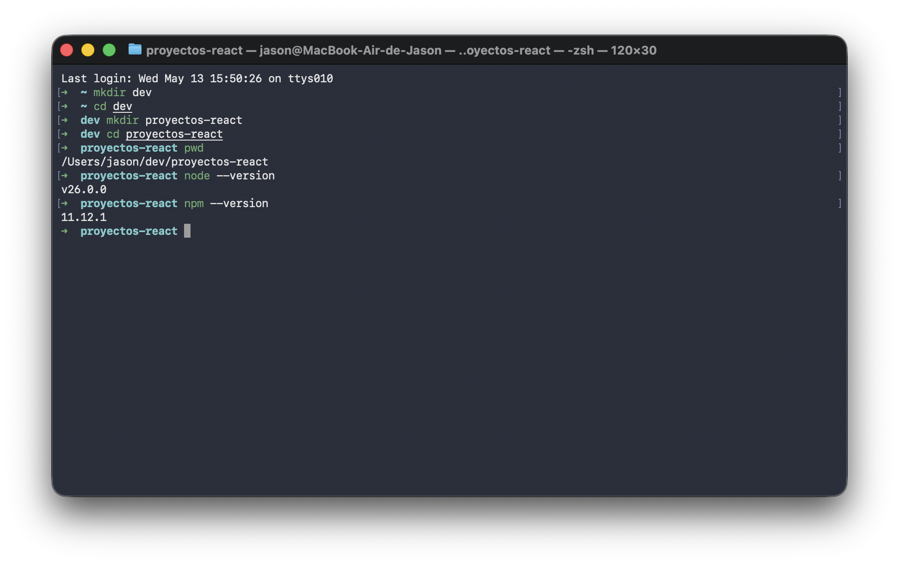
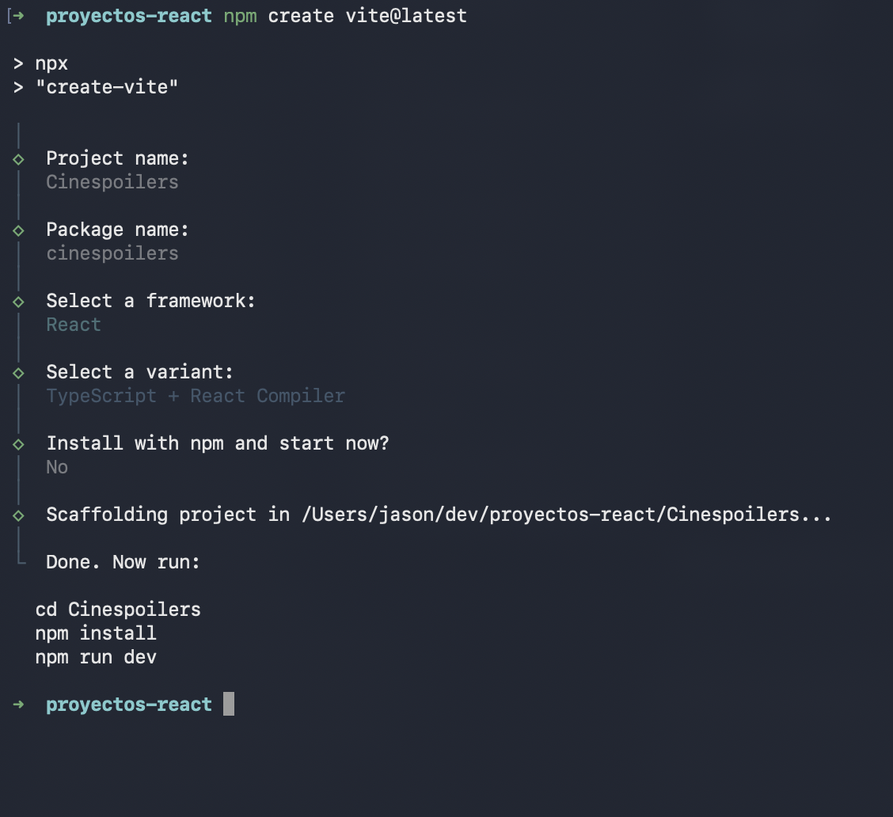
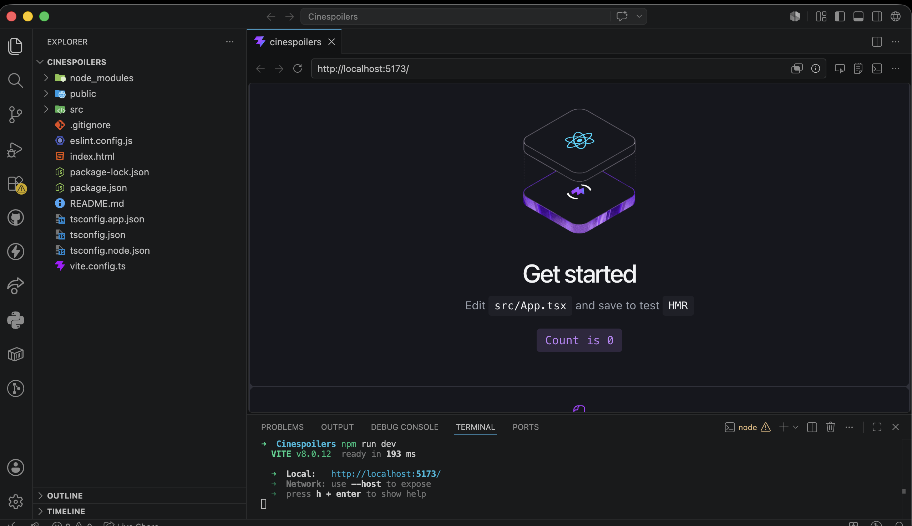
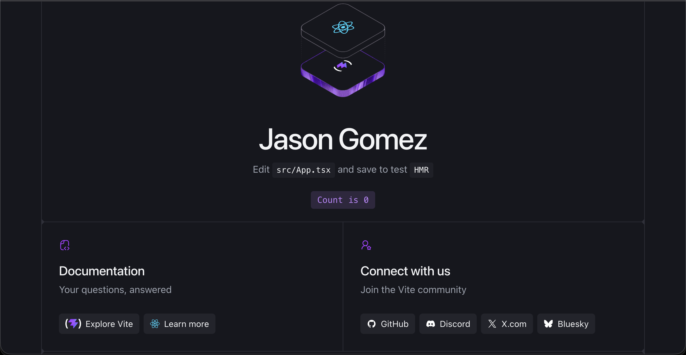
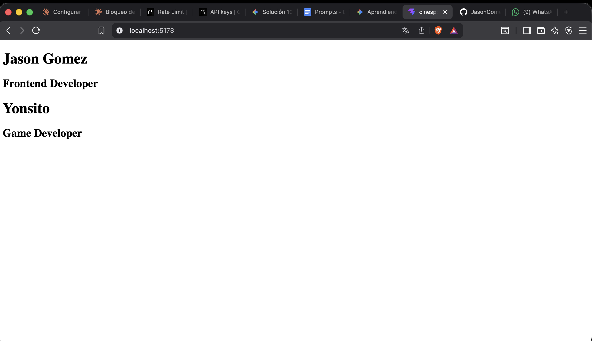

# Lab09DAE — Cinespoilers 🎬

Laboratorio 09 · Desarrollo de Aplicaciones Empresariales  
Proyecto React con Vite + TypeScript. Primer componente reutilizable con Props.

---

## Paso 1 — Entorno y carpetas

Se creó la carpeta de trabajo `dev/proyectos-react` y se verificaron las versiones de Node y npm.



---

## Paso 2 — Crear proyecto con Vite

```bash
npm create vite@latest
# Framework: React · Variant: TypeScript + React Compiler
```



---

## Paso 3 — Servidor corriendo

```bash
npm install
npm run dev
```



---

## Paso 4 — Primer cambio en App.tsx

Se reemplazó el contenido de demo por el nombre del desarrollador, probando el HMR de Vite.



---

## Paso 5 — Componente Profile con Props

Se creó `src/components/Profile.tsx`, un componente reutilizable que recibe `name` y `rol` como props y se usa dos veces con datos distintos.

```tsx
const Profile = ({ name = '', rol = '' }: { name: string, rol: string }) => (
  <header>
    <h1>{name}</h1>
    <h2>{rol}</h2>
  </header>
)
```

```tsx
<Profile name="Jason Gomez" rol="Frontend Developer" />
<Profile name="Yonsito" rol="Game Developer" />
```



---

## Stack

`React 19` · `TypeScript` · `Vite` · `Node v26` · `npm 11`

---

*Jason Gomez · 2026*